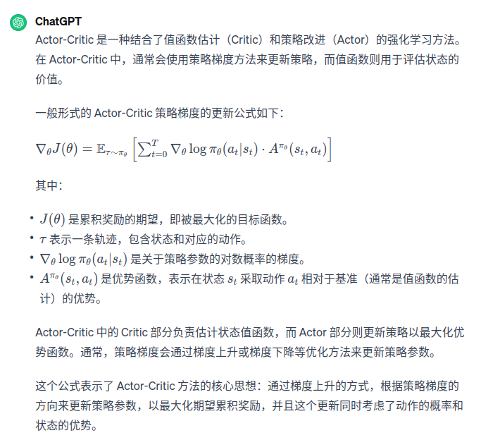

1、Actor-Critic算法简介【前沿算法的根基】  
有基于值函数的的方法DQN和基于策略的方法REINFORCE，基于值函数的方法只学习一个价值函数，而基于策略的方法只学习一个策略函数。
那么有没有什么方法能够既学习价值函数，又学习策略函数呢？Actor-Critic就是囊括一系列算法的整体架构，目前很多前言算法都基于Actor-Critic算法。
Actor-Critic算法本质上基于策略的算法，因为这一系列算法的目标都是优化一个带参数的策略，知识会额外学习价值函数，从而帮助策略函数更好地学习。  
2、Actor-Critic  
    Actor-Critic算法使用蒙特卡洛方法来估计Q(s,a)，也用蒙特卡洛方法来拟合一个值函数来指导策略进行学习。
    Actor-Critic在策略梯度中，可以把梯度写成下面更加一般的形式：上式子中使用的是优势函数，
还可以替换为时序差分残差、轨迹总回报、动作at之后的回报、基准线版本的改进、动作价值函数这些形式。
    REINFORCE通过蒙特卡洛采样方法对策略梯度的估计是无偏的，但是方差很大，我我们可以引入基线函数来减小方差。也可以采用Actor-Critic算法估计一个动作价值函数Q，
代替蒙特卡洛采样得到的回报。我们还可以把状态价值函数V作为基线，从函数Q减去这个函数V得到函数A，即优势函数。更进一步，我们可以利用Q=r+γV(st+1) - V(st)得到时序差分的形式
    书中，使用时序差分的形式来指导策略梯度进行学习。事实上，用Q值或者V值本质上也是用奖励,但是用神经网络进行估计的方法可以减小方差、提高鲁棒性。此外，REINFORCE算法基于蒙特卡洛采样，
只能在序列结束后进行更新，这同时也要求任务具有有限的步数，而Actor-Critic算法则可以在每一步之后都进行更新，并且不对任务的步数做限制。  
3、Actor-Critic网络构成
    (1)Actor策略网络，该网络与环境进行交互，并在Critic价值函数的指导下用策略梯度学习一个更好的策略。
    (2)Critic价值网络，该网络通过Actor与环境交互收集的数据学习一个价值函数，这个价值函数会用于判断在当前状态什么动作是好的，什么动作是不好的，进而帮助Actor进行策略更新。
4、Actor-Critic网络的实际设计
    Actor的更新采用策略梯度的原则。Critic价值网络表示为Vw，参数是w。我们采用时序差分残差的学习方式，对单个数据定义如下的损失函数：
        L(w)=1/2(r+γVw(st+1)-Vw(st))²
与DQN一样，我们采取类似的目标网络的方法，将r+γVw(st+1)作为时序差分目标，不会产生梯度来更新价值函数，价值梯度函数：∇wL(w)=-(r+γVw(st+1)-Vw(st))∇wVw(st)
Actor-Critic算法具体流程：  
初始化策略网络参数θ和价值网络参数w  
for 序列 e=1-->E do:
&emsp; 用当前策略πθ采样u轨迹{s1,a1,r1,s2,a2,r2,.....} #无限  
&emsp; 为每一步数据计算δt=rt+γVw(st+1)-Vw(st)  
&emsp; 更新价值参数w=w+aw∑δt∇wVw(st)
&emsp; 更新策略参数 θ= θ +aθ∑δt∇θlogπθ(at|st)  
end for  
5、结论
Actor-Critic算法很快便能收敛到最优策略，并且训练过程非常稳定，抖动情况比REINFORCE算法有了很大改进，说明价值函数的引入减少了方差