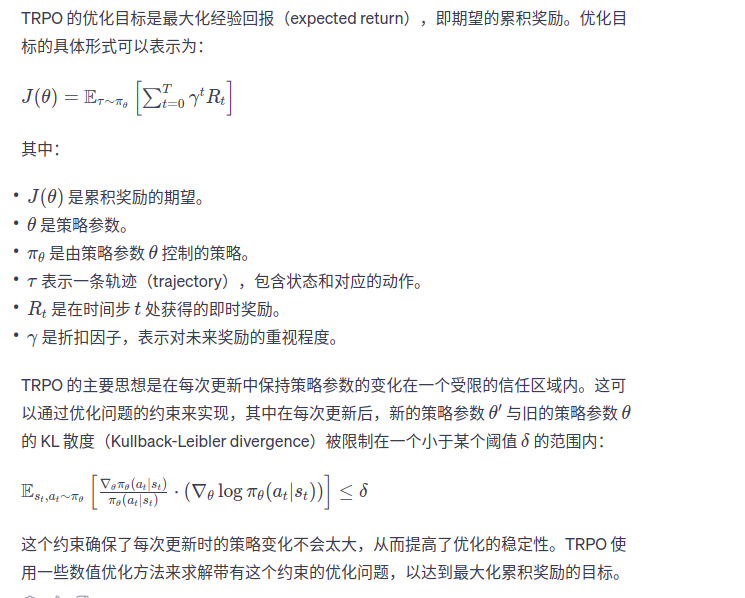
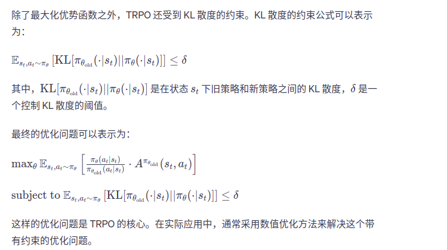

1、TRPO（Trust Region Policy Optimization）简介和之前算法存在的问题  
之前介绍基于策略的方法包括策略梯度算法阿和Actor-Critic算法，这些算法虽然简单直观，但是在实际应用过程汇总会遇到训练不稳定的情况。这些基于策略方法：
参数化智能体的策略，并设计衡量好坏的目标函数，通过梯度上升的方法来最大化这个目标函数，使得策略最优。具体来说，假设θ表示策略πθ的参数，定义
J(θ)=Es0[Vπ（s0)]=Es0[∑γt * r(st,at)] ，基于策略的方法的目标是找到θ*=argmaxJ(θ),策略梯度算法主要是沿着J(θ)的梯度方向迭代更新策略θ。
【策略梯度算法的问题】但是这种算法有一个明显的缺点：当策略网络是深度模型的时候，沿着策略梯度更新参数，很有可能由于步长太长，策略突然显著变差，进而影响训练效果。
我们在更新时找到一块信任区域，在这个区域上更新策略时能够得到某种策略性能的安全性抱枕，这就是信任区域策略优化（trust region policy optimizaion，TRPO）算法
的主要思想。TPRO在2015年提出，它在理论上能够保证策略学习的性能单调性，并在实际应用中取得比策略梯度算法更好的效果。  
2、策略梯度的目标--【TRPO使用近似的方法】【如何获得新旧策略的信任区域】
J(θ')-J(θ)=Eπθ[∑γt[r(st,at)+γVπ(st+1) - Vπθ(st)]]=（后面这部分是时序差分残差定义为优势函数A）=1/(1-γ) * Es~vπθ‘Ea~πθ‘[Aπθ(s,a)],我们要让该式子大于等于0，
就能保证策略性能单调递增。但是直接求解非常困难，因为πθ'是我们需要求解的策略，但是我们又要用它来收集样本， 把所有可能的新策略都拿来收集数据，然后判断哪个策略满足上述条件
的做法显然是不现实的。于是TRPO做了一步近似的操作，对状态访问分布进行了相应的处理。具体来说，就是忽略两个策略之间的状态访问分布变化，直接采用旧策略πθ的状态分布，
定义如下替代优化目标Lθ(θ')=J(θ)+1/(1-γ)*Es~vπθ‘Ea~πθ‘[Aπθ(s,a)]。当新旧策略非常接近时，状态访问分布变化很小，这样近似是合理的。其中，动作仍然用新策略πθ采样得到，
我们可以用重要性采样对动作分布进行处理。这样我们就可以基于旧策略πθ已经采样处的数据来估计并优化新策略πθ‘了。
为了保证新旧策略足够接近，TRPO采用了库尔贝克-莱布勒KL散度来衡量策略之间的距离，并给出了整体的优化公式：
这里的不等式定义了策略空间的一个KL球，称为信任区域。在这个区域中，可以认为当前学习策略和环境交互的状态分布与上一轮策略最后采样的状态分布一致，进而可以基于一步动作的重要性
采样方法使当前学习策略稳定提升。
3、近似求解的具体做法
（1）表示策略之间平均KL距离使用Hessian matrix黑塞矩阵，并使用KKT条件导出上述问题的解。
（2）计算和存储黑塞矩阵H的逆矩阵会耗费大量的内存资源和时间。TRPO使用共轭梯度法回避这个问题，核心思想是直接计算x=H^(-1)g,x是参数更新方向。
（3）最终推到参数更新方式为θ←θ+α⋅step_direction，其中step_direction=conjugate_gradient(∇f,H,tolerance)。书中写法θk+1=θk+根号下[(2ξ/x^(T)Hx)x],
我们可以直接计算x=H^(-1)g,H是正定矩阵，我们可以使用共轭梯度法求解
（4）共轭梯度公式流程  
初始化r0=g-Hx, p0=r0, x0=0  
&emsp;for k=0 -> N do:
&emsp; α=rk^(T)rk/(Pk^(T)HPk)  
&emsp;xk+1 = xk + akPk  
&emsp; rk+1=rk-akHPk
&emsp; 如果rk+1^(T)rk+1非常小，则退出循环  
&emsp; βk=(rk+1^(T)rk+1)/rk^(T)rk  
&emsp; pk+1=rk+1 + βkpk  
end for  
输出xN+1
在共轭梯度运算中，直接计算ak和rk+1需要计算和存储黑塞矩阵H。为了避免这个大矩阵的出现，我们只计算Hx向量，不直接计算和存储H矩阵。这样做比较容易，先用梯度和向量v点乘后再计算梯度。  
4、线性搜索  
TRPO算法用到了泰勒展开的1阶和2阶近似，并非精确求解，因此，θ'可能为比θk号，或未必能满足KL散度限制。TRPO在每次迭代的最后一次线性搜索，以确保找到满足条件。具体来说，
就是找到一个最小的非负整数i，使得θk+1公式来求出θk+1依然满足最初的KL散度限制，并且缺失能够提升目标函数Lθk
5、TRPO算法的流程  
初始化策略网络参数θ和价值网络参数w  
for 序列 e=1-->E do: 
&emsp;用当前策略πθ采样轨迹{s1, a1, r1, s2, a2, r2,...}  
&emsp;根据收集到的数据和价值网络估计每个状态动作对的优势A(st,at)  
&emsp;计算策略目标函数的梯度g
&emsp;用共轭梯度法计算x=H^(-1)g  
&emsp;用线性搜索找到一个i值，并更新策略网络参数θk+1=θk+a^(i)巴拉巴拉那个公式  
&emsp;为能提升策略并满足KL距离限制的最小整数  
&emsp;更新价值网络参数（与Actor-Critic中的更新方法相同）  
end for  
6、广义优势估计  
我们可以使用广义优势估计GAE来估计优势函数A。δt=rt+γV(st+1)-V(st)表示时序差分误差，V是一个已经学习的状态价值函数

