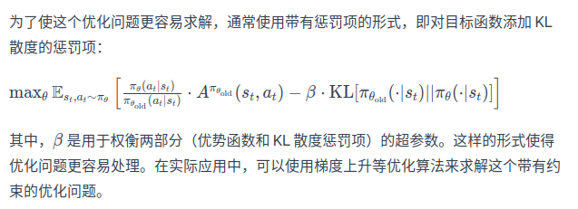
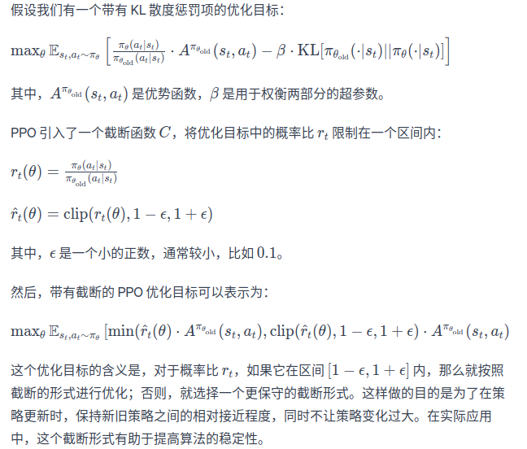

1、PPO简介  
Proximal Policy Optimizaion 近端策略优化，OpenAI提出。设计目的是为了解决策略优化时数值稳定性和样本利用率的问题，是一种基于策略梯度方法的改进算法。
PPO的主要思想是通过两个策略之间的“近端”目标来限制更新的幅度，从而防止在策略迭代中发生过大的变化，导致训练不稳定，这使得PPO在实践中更容易调优，同时具有更好的性能   
为了处理TRPO计算过程过于复杂的问题，PPO算法的优化目标与PPO相同，但是取代了TRPO中使用泰勒展开近似、共轭梯度、线性搜索等复杂计算，
PPO使用了一些简单处理方式，分为两种：PPO惩罚和PPO截断
2、PPO惩罚
PPO惩罚用拉格朗日惩罚数直接将KL散度的限制放进目标函数中，这就变成了一个无约束的优化问题，在迭代过程中，不断更新KL散度前的系数，更新的目标公式：
，β更新规则如下：（1）如果dk<δ/1.5,那么βk+1=βk/2：（2）如果dk>1.5*δ，那么βk+1=2*βk;(3)否则βk+1=βk。
其中δ是一个实现设定的超参数，用于限制学习策略和之前一轮策略的差距。  
3、PPO截断
PPO截断(PPO-Clip)更加直接，它在目标函数中进行限制，以保证新的参数和旧的参数的差距不会太大。更新公式:
其中，clip(x,l,r):=max(min(x,r),l)，即把x限制在[l,r]内。ε是一个超参数，表示进行截断clip的范围。如果Aπθk(s,a)>0说明这个动作价值高于平均值，最大化这个式子会增大
πθ'(a|s)/πθk(a|s),但不会让其超过1+ε。反之，如果Aπθk(s,a)<0，最大化这个式子会减小πθ'(a|s)/πθk(a|s)，但不会让其小于1-ε。   
4、PPO代码和PPO在实践中的地位  
先给结论：PPO截断比PPO惩罚效果好。PPO是TRPO的一种改进算法，它在实现上简化了TRPO中的复杂计算，并且在实验中的性能大多数情况比TRPO更好，因此
目前change被用作一种常用的基准算法。需要注意的是，TRPO和PPO都属于在线策略算法，即时优化目标中包含重要性采样过程，但其只用到了上一轮策略的数据，
而不是过去所有策略的数据。PPO是TRPO的第一作者John Schulman在OpenAI公司研究出来，目前论文额引用量超过了TRPO。