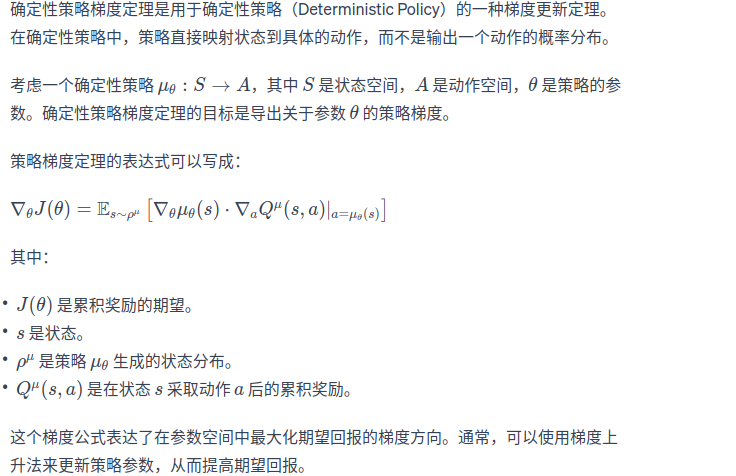

1、简介  
基于策略梯度的算法有REINFORCE、Actor-Critic以及两个改进算法TRPO和PPO。这类算法有一个共同特点：它们都是在线策略算法，这意味着它们的样本效率
比较低。DQN算法[chpt7]直接估计最优函数Q，可以做到离线策略学习，但是他只能处理动作空间有限的环境,这是因为它需要从所有动作中挑选一个Q值最大的动作。
如果这个动作个数是无限的，我们可以将动作空间离散化，但是这样做比较粗糙，无法精细控制。那么有没有办法可以类似的思想类处理动作空间无限的环境并且使用
离线策略算法呢？DDPG（deep deterministic policy gradient 深度确定性策略梯度，因为有一个公用的深度网络）就是这样的算法，它构造一个确定性策略，用梯度上升的方法来最大化Q值。
DDPG也属于一种Actor-Critic算法。之前的REINFORCE、TRPO和PPO学习的是一个随机性策略，DDPG学习一个确定性策略

2、DDPG[特点：加入目标网络和软更新来更新目标网络]  
（1）DDPG的确定性策略  
我们之前学习的策略是随机性的，可以表示为a~πθ(·|s)。确定性策略可以表示为a=μθ(s).与策略梯度定理类似，我们可以推导出确定性策略梯度定理
图中式子，ρμ用来收集数据的行为策略。我们可以这样理解这个定理：假设现在已经有函数Q，给定一个状态s，但由于现在动作空间是无限的，无法通过遍历所有动作来得到Q值最大的动作，
因此我们想用策略μ来找到使得Q(s,a)值最大的动作a，即μ(s)=arg maxaQ(s,a).此时，Q就是Crititc，μ就是Actor，这是一个Actor-Critic架构。
（2）如果求策略μ  
受限用Q对μθ求导：∇θQ(s,μθ(s))，其中会用到梯度的链式法则，先对a求导，再对θ求导。然后通过梯度上升的方式来最大化函数Q，得到Q值最大的动作。  
（3）DDPG用到的神经网络  
a.fixed network trick
DDPG用到4个神经网络，其中Actor和Critic各用一个网络，此外它们都各自有一个目标网络。用到目标网络
【本章目标：让Qw(s,a)逼近r+γQ(s', a'),由于TD误差目标本身就包含神经网络的输出，因此在更新网路参数的同时目标也在不断地改变，这非常容易造成神经网络训练的不稳定。
为了解决这一问题，DQN使用了目标网络target network的思想：既然在训练过程中Q网络的不断更新会导致目标不断发生改变，不如暂时先将TD误差目标中的Q网络固定住。
为了这一思想，我们需要利用两套Q网络】
是因为，DDGP和DQN一样，更新的时候更新目标在不断变动，
会造成更新困难，使用固定网络Fixed network的trick技术，先冻结住用来求target的网络，再更新之后把参数复制到target网络。 
DDPG的目标网络的更新与DQN略有不同：在DQN中，每隔一段时间将Q网络直接复制给目标Q网络；再DDPG中，目标Q网络的更新采取的是一种软更新的方式，即让目标Q网络缓慢更新，
逐渐接近Q网络公式为：w- <--- τw+(1-τ)w-,τ是一个比较小的数，当τ=1的时候，DDPG和DQN的更新方式就一样了。目标μ网络也使用这种软更新的方式。  
b.Double DQN更新Q网络
函数Q存在Q值过高估计的问题，DDPG采用Double DQN中的技术来更新Q网络，但是DDPG采用确定性策略，本身探索有限，DDPG在行为策略上引入一个随机噪声Ν来进行探索

3、DDPG伪代码  
随机噪声用N来表示，用随机的网络参数w和θ来分别初始化Critic网络Qw(s,a)和Actor网络μθ(s)  
复制相同的参数w- <--- w 和 θ- <-- θ，分别初始化目标网络Qw-和μθ-  
初始化经验回放池R  
for 序列 e=1-->E do:
&emsp;初始化随机过程N（噪声），用于动作探索  
&emsp;获取环境初始状态s1  
&emsp;for 时间步 t=1-->T do:
&emsp;&emsp 根据当前策略和噪声选择动作at=μθ(st) + N
&emsp;&emsp 执行动作at， 获得奖励rt， 环境状态变为st+1  
&emsp;&emsp 将(st,at,rt,st+1)存储进回放池R  
&emsp;&emsp 从R中采样N个元组{(si, ai, ri, s'i)}i=1...N #离线策略梯度的明显标志  
&emsp;&emsp 对每个元组，用目标网络计算yi=ri+γQw-(si+1, μθ-(si'))
&emsp;&emsp 最小化目标损失L=1/N∑(N,i=1)(yi-Qw(si,ai))²，以此更新当前Critic网络
&emsp;&emsp 计算采样的策略梯度，以此更新当前Actor网络：   
&emsp;&emsp 更新目标网络：w- <--- τw+(1-τ)w-， θ- <--- θ+(1-τ)θ-
&emsp; end for  
end for

4、结论
DDPG再倒立摆环境中表现出学习速率快（70左右就能稳定），不需要太多样本的优秀特征
