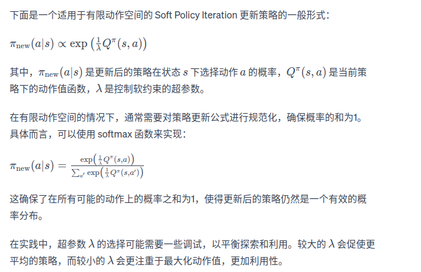
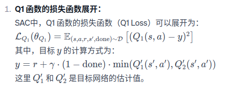
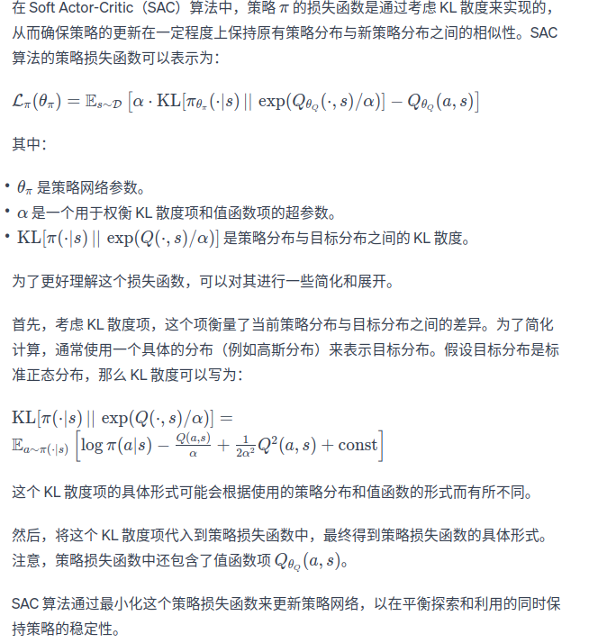
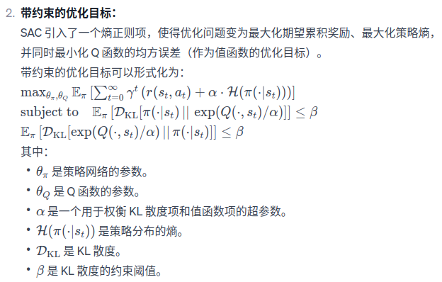

传统强化学习（Traditional Reinforcement Learning）和最大熵强化学习（Maximum Entropy Reinforcement Learning）之间存在一些关键区别。在理解这两者之间的差异时，可以考虑以下几个方面：

1. 目标函数的不同：
传统强化学习： 通常采用期望累积奖励最大化作为目标。即，智能体的目标是找到一个策略，使得未来累积的奖励最大化。
最大熵强化学习： 强调最大熵原理，目标是在满足约束条件的情况下，最大化策略的熵。这意味着它不仅关注奖励的最大化，还试图保持对环境的不确定性。
2. 探索与利用的权衡：
传统强化学习： 通常关注在学习过程中对未知环境的探索，以便获取更多信息。
最大熵强化学习： 将探索视为一种正则化，通过最大化策略的熵来平衡探索和利用。这使得智能体更有可能尝试新的动作，以便更好地了解环境。
3. 状态分布的建模：
传统强化学习： 通常不明确地建模状态分布。
最大熵强化学习： 关注建模状态分布，以便更全面地理解环境和智能体与环境的互动。
图示：
为了更清晰地展示这些区别，可以考虑使用图示来表示传统强化学习和最大熵强化学习的算法框架、目标函数、以及与环境之间的交互过程。这可能包括表示状态、动作、奖励、价值函数等的图表，以便形象地说明它们之间的关系。

请注意，图示的具体形式可能会因应用场景和具体算法而有所不同。如果您需要更具体的图示，建议查阅相关文献或教材，或者在相关研究论文中寻找详细的可视化信息。  
1、SAC算法简介  
之前介绍的在线策略算法的采样效率比较低，我们通常更倾向于使用离线策略算法。然而，虽然DDPG是离线策略算法，但是它的训练非常不稳定，收敛性
较差，对超参数比较敏感，也难以适应不同的复杂环境。2018年，一个更加稳定的离线策略算法soft Actor-Critic(SAC)被提出。SAC的前身是soft Q-learning，
它们都属于最大熵强化学习的范畴。soft Q-learning不存在显式的策略函数，而是使用了一个函数Q的玻尔兹曼分布，在连续空间下求解非常麻烦。于是SAC
提出使用一个Actor表示策略函数，从而解决这个问题。目前，在物模型的强化学习算法中，SAC是一个非常高效的算法，它学习一个随机性策略，在不少标准环境中取得了领先的成绩。

2、最大熵强化学习  
熵表示对一个随机变量的随机程度的度量。具体而言，如果X是一个随机变量，且它的概率密度函数为P，那么它的熵H就被定义为：H(X)=Ex~p[-logp(x)]
在强化学习中，我们可以使用H(π(·|s))来表示策略π在状态s下的随机程度。  
最大熵强化学习的思路就是除了要最大化累积奖励，还要使得策略更加随机。如此，强化学习的目标中加入了一项熵的正则项，定义为
π* = arg maxEπ[Σr(st,at) + aH(π(·|st))]，其中，a是一个正则化的系数，用来控制熵的重要程度。  
熵正则化增加了强化学习算法的探索程度，a越大，探索性就越强，有助于加速后续的策略学习，并减少策略陷入较差的局部最优的可能性。
传统强化学习和最大熵的强化学习的区别，就是在这个山峰的动作换到另一个山峰进行选择。

3、Soft策略迭代
在最大熵强化学习框架中，目标函数发生了变化。首先，soft贝尔曼方程：Q(st, at)=r(st,at)+γEs(t+1)[V(st+1)],其中状态价值函数被写为：
V(st)=Eat~π[Q(st,at)-alogπ(at|st)]=Eat~π[Q(st,at)]+H(π(·|st))。于是，根据该soft贝尔曼方程，在有限的状态和动作空间下，Soft策略评估可以收敛到策略π
的soft Q函数。然后，根据如下soft策略提升公式可以改进策略：
重复交替使用soft策略评估和soft策略提升，最终策略可以收敛到最大熵强化学习目标中的最优策略。但该soft策略迭代方法只适用于表格型设置的情况，即状态空间和
动作空间有限的情况。再连续空间下，我们需要通过参数化Q和策略π来近似这样的迭代。

4、SAC
在SAC算法中，我们为两个动作价值Q（参数分别为w1和w2）和一个策略函数π（参数为θ）建模。基于Double DQN思想，SAC使用两个Q网络，但每次用Q网路时会挑选一个
Q值小的网络，从而缓解Q值过高估计的问题。任意一个函数Q的损失函数为,r是策略过去收集的数据，
因为SAC是一种离线策略算法。为了让训练更加稳定，这里使用了目标Q网络Qw-，同样是两个目标Q网络，与两个Q网络一一对应。SAC中目标Q网络的更新方式与DDPG中的更新
方式一致。  
策略π的损失函数由KL散度得到，化简后为【注意：书中的写法更简单：
Lπ(θ)=Est~R,at~πθ[alog(πθ(at|st))-Qw(st,at)]】,可以理解为最大函数V，因为有V(st)=Eat~π[Q(st,at)-alogπ(at|st)]。  
对于连续动作空间的环境，SAC算法的策略输出高斯分布的均值和标准差，但是根据高斯分布来采样动作的过程是不可导的。因此我们要用重参数化技巧。重参数化的做法
是先从一个单位高斯分布N采样，再把采样值乘以标准差后加上均值。这样就可以认为是从策略高斯分布采样，并且这个采样动作的过程对于策略函数是可导的，可将该策略函数表示为
at=fθ(εt;st),其中，εt是一个噪声随机变量。同时考虑两个函数Q，重写策略的损失函数：Lπ(θ)=Est~R,εt~N[alog(πθ（fθ(εt;st)）-minQwj(st,fθ(εt;st)))]

5、自动调整熵正则项  
如何选择熵正则项的系数非常重要。在不同的状态下需要不同大小的熵：在最优动作的不确定某个状态下，熵的取值应该大一些；而在某个最优动作比较确定的状态下，
熵的取值可以小一点。为了调整熵的正则项，SAC将强化学习的目标改写为一个带约束的优化问题：
书中写为:maxEπ[Σr(st,at)] st. E(st,at)~ρπ[-log(πt(at|st))]≥H0.也就是最大期望回报，同时约束熵的均值大于H0.通过一些数学技巧进行简化后得到α的损失函数
L(α)=Est~R,at~π(·|st)[-αlogπ(at|st)-αH0].即当策略的熵低于目标值H0时，训练目标L(α)会使α的值增大，进而在上述最小化损失函数Lπ(θ)的过程中增加了策略熵对应项的重要性；
而当策略的熵高于目标值H0的时候，训练目标L(α)会使α的值减小，进而使得策略训练时更专注于价值提升。

6、SAC算法流程如下：  
用随机的网络参数w1、w2和θ分别初始化Critic网络Qw1(s,a)、Qw2(s,a)和Actor网络πθ(s)  
复制相同的参数w1-<---w1,w2-<----w2,θ-<---θ，分别初始化目标网络Qw1-，Qw2-和πθ-  
初始化经验回放池R
for序列 e=1--->E do    
&emsp;获取环境初始状态s1  
&emsp;for 时间步t=1-->T do  
&emsp;&emsp;根据当前策略选择动作at=πθ(st)  
&emsp;&emsp;执行动作at，获得奖励rt，环境状态变为st+1  
&emsp;&emsp;将(st,at,rt,st+1)存入回放池R  
&emsp;&emsp;for 训练轮数k=1-->K do    
&emsp;&emsp;&emsp;从R中采样N个元组{(si, ai, ri, si+1)}i=1,...,N    
&emsp;&emsp;&emsp;对每个元组，用目标网络计算yi=ri+γminj=1,2Qwj-(si+1,ai+1)-alogπθ(ai+1|si+1),其中ai+1~πθ(·|si+1)  
&emsp;&emsp;&emsp;对两个Critic网络都进行如下更新：对j=1，2，最小化损失函数L=1/NΣ(yi-Qwj(si,ai))²  
&emsp;&emsp;&emsp;用重参数化技巧采样动作ai~,然后用一下损失函数更新当前的Actor网络：Lπ(θ)=1/NΣ(αlogπθ(ai~|si)-minj=1,2Qwj(si,ai~))  
&emsp;&emsp;&emsp;更新熵正则项新的系数α  
&emsp;&emsp;&emsp;更新目标网络：w1<--τw1+(1-τ)w1-，w2<--τw2+(1-τ)w2-  
&emsp;&emsp;&emsp;end for  
&emsp;&emsp;end for  
&emsp;end for  

7、结论：
SAC在连续环境（倒立摆环境）中，表示非常出色，在离散环境车杆下，也具有完美收敛性能，并且其策略回报的曲线十分稳定，体现出SAC可以在离散动作环境下平衡探索与利用的优秀性质。
由于其扎实的理论基础和优秀的实验性能，SAC称为炙手可热的深度强化学习算法，很多研究开始基于SAC算法。