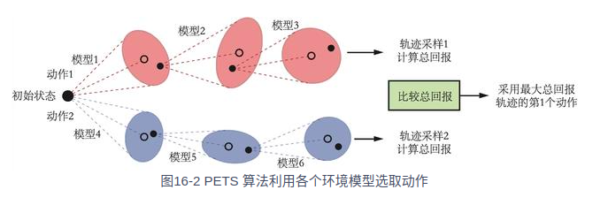

1、模型预测控制简介  
前面介绍的都是基于值函数的方法DQN、基于策略的方法REINFORCE以及两者结合的方法Actor——Critic。它们都是物模型model-free方法，即没有
建立一个环境模型来帮助智能体决策。而在深度强化学习领域中，基于模型的方法通常用于神经网络学习一个环境模型，然后利用该环境模型来帮助智能体
训练和决策。利用环境模型版帮助智能体训练和决策的方法有很多种，例如可以用于之前的Dyna类似的思想生成一些数据来加入策略训练中。
本章介绍的模型预测控制（model predictive control，MPC）算法并不是构建一个显示的策略，只根据环境模型来选择当前步采取的动作。
2、打靶法
    模型预测控制方法是一种迭代的基于模型的控制方法。MPC方法中不存在一个显式的策略。具体而言，MCP方法在每次采取动作时，受限会生成一些
候选动作序列，然后根据当前状态来确定每一条候选序列能够得到多好的结果，最终选择结果最好的那条动作序列的第一个动作来执行。因此，
在使用MPC方法时，主要在两个过程中迭代，一个是根据历史数据学习环境模型P^(s,a),二是在和真实环境的交互过程中用环境模型来选择的动作。
    受限，我们定义模型预测方法的目标。在第k步时，我们要做的就是最大化智能体的累积奖励，具体就是：argmaxΣr(st,at) ,st. st+1 = P^(st,at)
 其中，H为推演的长度，argmaxakk+H表示从所有动作序列中选取累积奖励最大的序列。我们每次选取最优序列中的第一个动作ak来与环境交互。
 MPC方法的一个关键点就是如何生成一些候选动作序列，候选动作生成的好坏将直接影响到MPC方法得到的动作。生成候选动作序列的过程为打靶shooting。
 3、随机打靶法
    随机打靶法（random shooting method）的做法是随机生成N条动作序列，即在生成每条动作序列的每一个动作时，都是从动作空间中随机采样一个动作，
 最终组合成N条长度为H的动作序列。
    对于一些简单的环境，这个方法补单十分简单，而且效果不错。那么，能不能再随机采样得基础上，根据已有得结果做的更好一些呢？那就是交叉熵方法
 4、交叉熵打靶法
 交叉熵方法（cross entropy method，CEM）是一种进化策略方法，它的核心思想是维护一个带参数的分布，根据每次采样的结果来更新分布中的参数，使得分布中能够获得
 较高积累奖励的动作序列的概率比较高。相比于随机打靶法，交叉熵方法能够利用之前采样的比较好的结果，在一定程度上减少采样到较差动作的概率，
 从而使得算法更加高效。对于一个与连续动作交互的环境，每次交互时交叉熵的做法伪代码：  
 for 次数e=1->E do:  
 &emsp;从分布P(A)中选取N条动作序列A1,..An  
 &emsp;对于每条动作序列A1,...An用环境模型评估累积奖励  
 &emsp;根据评估结果保留M条最优的动作序列Ai1...Aim  
 &emsp;用这些动作序列Ai1....Aim更新分布P(A)  
&emsp; end for  
计算所有最优动作序列的第一个动作的均值，作为当前时刻采取的动作。  

5、PETS算法
带有轨迹采样的概率集成（probabilistic ensembles with trajector sampling，PETS）是一种使用MPC的基于模型的强化学习算法，
在PETS中，环境模型采用集成学习的方法，即欧冠建多个环境模型，然后用这多个环境模型来进行预测，最后使用CEM进行模型预测控制。接下来，我们详细介绍
模型构建与模型预测的方法。
在强化学习中，与智能体交互的环境是一个动态系统，所以拟合它的环境也通常是一个动态模型。我们通常认为一个系统中有两种不确定性，分别是偶然不确定性和
认知不确定性。偶然不确定性由系统本身存在的随机性引起的，而认知不确定性是由见过的数据较少所导致的自身认知的不足而引起的。
在PETS算法中，环境模型的构建会同时考虑这两种不确定性。受限，我们定义环境模型的输出为一个高斯分布，用来捕捉偶然不确定性。
令环境模型为P^,其参数为θ，那么基于当前状态动作对(st,at),下一个状态st的分布可以写为Pθ^(st,at)=N(μθ(st,at),Σθ(st,at))
这里我们可以采用神经网络来构建μθ和Σθ，这样，神经网络的损失函数为L(θ) = Σ[μθ(sπ,aπ)-sn+1]^TΣθ^(-1)(sn,an)[μθ(sn,an) - sn+1]+log detΣθ(sn,an)
这样我们就得到了一个由神经网络表示的环境模型。在此基础上，我们选择用集成ensemble的方法来捕捉认知不确定性。具体而言，我们构建B个网络框架一样的神经网络，
它们的输入都是状态动作对，输出都是下一个状态的高斯分布的均值向量和协方差矩阵。但是他们的参数采用不同的随机初始化方式，并且当每次训练时，会从真实数据中随机采样
不同的数据来训练。
有了环境模型的集成后，MPC算会用其来预测奖励下一个状态。具体来说，每一次预测会从B个模型中挑选一个来进行预测，因此一条轨迹的采样会用到多个环境模型。

6、结论
PETS算法的效果非常好，但是由于每次选取的动作都需要在环境模型上进行大量的模拟
因此运行速度非常缓慢。与SAC算法的结果对比看出，PETS算法大大提高了样本效率，在比SAC算法的环境交互次数少得多的情况下取得了差不多的效果。
我们可以看出模型预测控制MPC方法有着独特的优势，它不需要构建和训练策略，可以更好利用环境，可以进行更长步数的规划。
但是MPC也有局限性，例如模型在多步推演后的准确性会大大降低，简单的控制策略对于复杂系统可能不够。
MPC还有一个更为严重的问题，即每次计算动作的复杂度太大，这使其在一些策略即时性要求较高的系统中应用就变得不现实。