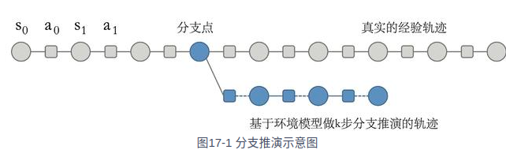

1、简介
PETS算法是基于模型的强化学习算法中的一种，没有明显构建一个策略（即一个从状态到动作的映射函数）。Dyna-Q，它也是一种基于模型的强化学习算法。
但是Dyna-Q算法中的模型只存储之前遇到的数据，只适用于表格型环境，而在连续型状态和动作的环境中，我们需要像PETS算法一样学习一个
用神经网络表示的环境模型，此时若继续利用Dyna的思想，可以在任意状态和动作下用环境模型来生成一些虚拟数据，这些虚拟数据可以帮助
进行策略的学习。如此，通过和模型进行交互产生额外的虚拟数据，对真实环境中样本呢的需求量就会减少，因此通常会比无模型的强化学习算法具有更高的采样效率
2、MBPO算法[2019]
基于模型的策略优化model-based policy optimization,MBPO算法是博可以在NeurIPS会议中提出。随机，MBPO称为深度强化学习中最重要的基于模型的强化学习算法之一。
MBPO算法基于以下两个关键的观察：（1）随着环境模型的推演步数变长，模型累积的复合误差会快速增加，使得环境模型得出的结果变得很不可靠；（2）必须要权衡推演步数增加后模型增加的误差带来的负面作用于步数
增加后使得训练的策略更优的正面作用，二者的权衡决定了推演的步数。  
MBPO算法在这两个观察的基础上，提出只使用模型来从之前访问过的真实状态开始进行较短步数的推演，而非从初始状态开始进行完整的推演。这就是MBPO中的分支推演（branched rollout）的概念，
即在原来真实环境中采样的轨迹推演出新的“短分支”，如图。。MBPO于Chpt6中的经典的Dyna-Q算法十分类似。Dyna-Q采用
的无模型强化学习部分是Q-learning，而MBPO采用的是SAC。此外，MBPO算法中环境模型的构建和PETS算法中一致，都使用模型集成的方法，
并且每一个环境模型的输出都是一个高斯分布。MBPO的算法框架把真实环境样本作为分支推演的起点，使用模型进行一定步数的推演，并且推演得到的模型数据来训练模型。  
伪代码：  
初始化策略πφ、环境模型参数pθ、真实环境数据集Denv、模型数据集Dmodel  
for 轮数 n=1->N do  
&emsp;通过环境数据来训练环境模型参数pθ
&emsp;for 时间步 t=1-->T do  
&emsp;&emsp; 根据策略πφ与环境交互，并将交互的轨迹添加到Denv中  
&emsp;&emsp; for 模型推演次数e=1-->E do  
&emsp;&emsp;&emsp; 从Denv中均匀随机采样一个状态st  
&emsp;&emsp;&emsp; 以st为初始状态，在模型中使用策略πφ进行k步推演，并将生成的轨迹添加到Dmodel中  
&emsp;&emsp;&emsp;end for  
&emsp;&emsp;&emsp;for 梯度更新次数g=1-->G do  
&emsp;&emsp;&emsp;&emsp;基于模型数据Dmodel，使用SAC来更新参数πφ  
&emsp;&emsp;&emsp;end for  
&emsp;&emsp;end for  
&emsp; end for  
分支推演的长度k是平衡样本效率和策略性能的重要超参数。  
3、结论  
相比物模型的强化学习算法，基于模型的方法MBPO在样本效率上要高很多，虽然这里的效果不如PETS算法优秀，但是
在复杂的环境中，如Hopper和HalfCheetah，MBPO的表现要好于PETS算法

