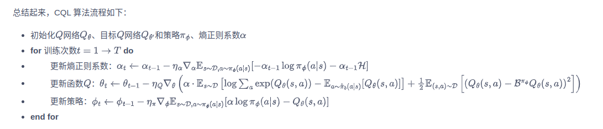

1、离线强化学习简介  
无论是在线策略on-policy算法还是离线策略off-policy算法，都有一个共同点：智能体在训练过程中可以不断和环境交互，得到新的反馈数据。二者的区别主要是在于在线策略算法会直接使用这些反馈数据，而离线策略算法会先将这些反馈数据
存入经验回放池中，需要时再采样。然而，在现实生活中的许多场景下，让尚未学习好的智能体和环境交互可能会导致危险发生，或者造成巨大损失。例如，在训练自动
驾驶的规控智能体时，如果让智能体从零开始和真实环境交互，难么在训练的最初截断，它操控的汽车无疑会横冲直撞，造成各种事故。
再例如，在推荐系统中，用户的反馈往往比较滞后，统计智能体策略的回报需要很长时间。而如果策略存在问题，早期的用户体验不佳，就会导致用户流失等后果。
因此，离线强化学习offline reinforcement learning的目标是：在智能体不和环境交互的情况下，仅从已经收集好的确定的数据集中，
通过强化学习算法得到比较好的策略。离线强化学习和在线策略算法、离线策略算法的区别。  
2、批量限制Q-learning 算法  
离线强化学习和离线策略强化学习很像，都要从经验回放池中采样进行训练，并且离线策略算法的策略评估方式多种多样。研究者们最开始尝试将离线策略算法直接照搬到
离线环境下，仅仅去掉算法中和环境交互的部分。然而，失败了。经过试验证明，外推误差是离线策略算法不能直接迁移到离线环境中的原因。
外推误差，是指由于当前策略访问到的状态动作对与从数据集中采样得到的状态动作对的分布不匹配而产生的误差。为什么在线强化学习算法没有收到外推误差的影响呢？
因为对于在线强化学习，即时训练时离线的，智能体依然有机会通过与环境交互及时采样到新的数据，从而修正这些误差。但是在离线强化学习中，
智能体无法和环境交互。因此，一般来说，离线强化学习算法要想办法尽可能地限制外推误差的大小，从而得到较好的策略。
为了减少外推误差，当前的策略需要做到只访问与数据集中相似的（s,a）数据。满足这一要求的策略被称为批量限制策略（batch-constrined policy）。
具体来说，这样的策略在选择动作时有3个目标：（1）最小化选择的动作与数据集中的数据的距离（2）采取动作后能达到与离线数据集中的状态相似的状态
（3）最大化函数Q。对于标准的表格环境，状态空间和动作空间都是离散且有限的，标准的Q-Learning公式：Q*(s,a) = (1-a)Q(s,a) + a(r+γQ(s',argmaxa'Q(s',a'))) 
这时，只要把策略π能选择的动作限制在D内，就能满足上述三个目标的平衡，这样就得到了表格设定下的批量限制bat-constrained Q-learning，BCQ算法
Q*(s,a) = (1-a)Q(s,a) + a(r+γQ(s',argmaxa'Q(s',a'))) ,a'st.(s'a')∈D。可以证明，如果数据中包含所有可能的（s,a）对，按照上式进行迭代可以收敛到最优的价值函数Q*。
连续状态和动作的情况要复杂，因为批量限制策略的目标需要被更详细地定义，比如，如何定义两个状态动作对的距离，BCQ采用了巧妙的方法：训练一个生成模型Gw(s)。对于数据集D
和其中的状态s，生成模型Gw(s)能给出与D中数据接近的一系列动作a1....an用于Q网络的训练。更进一步，为了增加生成动作的多样性，减少生成次数，BCQ还引入了扰动模型
ξφ(s,a,Φ)。输入(s,a)时，模型给出一个绝对最大为Φ的微扰并附加在动作上，着两个模型总和起来相当于给出了一个批量限制策略π：π(s)=argmaxat+ξφ(s,a,Φ)[Qθ(s,ai+ξφ(s,a,Φ))],
其中，生成模型Gw(s)用变分自动编码器VAE实现；扰动模型直接通过确定性策略梯度算法训练，目标是使函数Q最大化。
BCQ伪代码：
随机初始化Q网络Qθ、扰动模型ξφ、生成模型Gw={Ew1,Dw2}  
用θ初始化目标Q网络Qθ-，用φ初始化目标扰动网络，ξφ‘  
for 训练次数e=1-->E do  
&emsp; 从数据集D中采样一定数量的(s,a,r,s')  
&emsp;编码器生成均值和标准差μ,σ=Ew1(s,a)  
&emsp;解码器生成动作a~=Dw2(s,z)，其中z~N(μ,σ)
&emsp;更新生成模型：w<--argminΣ(a-a~)² + Dkl(N(μ，σ)||N(0,1))  
&emsp;从生成模型中采样n个动作：{ai~Gw(s')}i=1到n  
&emsp;对每个动作施加扰动:{ai <-- ai + ξφ(s,a,Φ)}i=1到n
&emsp;计算Q网络的目标值:y = r + γmaxaQθ-(s',ai)  
&emsp;更新Q网络θ<--argminθΣ(y-Qθ(s,a))²  
&emsp;更新扰动模型：Φ <-- argmaxφΣQθ(s, a + ξφ(s,a,Φ)),a~Gw(s)  
&emsp;更新目标Q网络θ- <-- τθ+(1-τ)θ-  
&emsp;更新目标扰动模型 Φ‘<--τΦ+(1-τ)Φ'  
end for  

3、保守Q-learning算法
试验证明，外推误差主要会导致在远离数据集的点上函数Q的过高估计，甚至常常出现Q值向上发散的情况。因此，如果能用某种方法将算法中偏离数据集的点上的函数Q保持在很低的值，
或许能消除部分外推误差的影响，这就是保守Q-learning(conservative Q-learning,CQL)算法的基本思想。CQL通过在普通的贝尔曼方程上引入一些额外的限制项，达到了这一目标。
,Bπ是实际计算时策略π的贝尔曼算子。为了防止Q值在各个状态上（尤其是不在数据集中的状态上）的过高估计，我们要对某些状态上的高Q值进行惩罚。
考虑一般情况，我们希望Q在某个特定分布μ(s,a)上的期望值最小。上式子中，Bπ^的计算需要用到s、a、s‘、a’,但只有a'是生成的，可能不在数据集中。因此我们对数据集中的状态s按照策略μ得到的动作
进行惩罚.其中，β是平衡因子。可以证明，上式迭代收敛给出的函数Q在任何(s,a)上的值都比真实值小。不过，我们如果放宽条件，只追求Q
在π(a|s)上的期望Vπ比真实值小的话，就可以略微放松对上式的约束，一个自然的想法就是，对于复合用于生成数据集的行为策略πb的数据点，我们可以认为Q对这些点的估值比较准确，在这些点上不必限制让Q
值很小。作为对第一项的补偿，将上式改为：.将行为策略πb写为πb^是因为我们无法获知真实的行为策略，只能通过数据集中已有的数据
近似得到。可以证明当π=μ时，上式收敛得到的函数Q虽然不是在每一点上都小于真实值，但其期望是小于真实值的，即Eπ(a|s)[Q^π(s,a)]≤Vπ(s).
    至此，CQl算法已经有了理论上的保证，但是仍有一个缺陷：计算时间开销太大，当令μ=π时，在Q迭代的每一步，算法都要对策略π^k做完整的离线策略评估来计算上式中的argmin，在进行一次策略迭代，
    而离线策略评估是非常耗时的，既然π并非与Q独立，而是通过Q最大的动作衍生出来的，那么我们完全可以用Q取最大值的μ去近似π，即：
    为了防止过拟合，再加上正则项R(μ)。总和起来就得到完整的迭代方程：.
    正则项采用和一个先验策略ρ(a|s)的KL距离，即R(μ)=-Dkl(μ,ρ)。一般来说，取ρ(a|s)为均匀分布μ(a),迭代方程化简为：
    简化后已经不含有μ，为了计算提供了很大方便。
    上面给出了函数Q的迭代方法。CQl属于直接在函数Q上做限制的一类算法，对策略π没有特殊要求，眼啫喱只给出基于SAC的CQL版本。
    伪代码：
    
4、结论
离线强化学习另一大难点是算法通常对超参数极为敏感，难调参。并且在实际复杂场景中通常不像在模拟器中那样，每训练几轮就在环境中评估策略
好坏。因此，如何确定何时停止算法也是离线强化学习在实际应用中的一个挑战。此外，离线强化学习在现实场景中的落地还需要关注离散策略评估和选择、
数据收集策略的保守性和数据缺失性等现实问题。不过无论如何，离线强化学习和模仿学习都是为了解决现实中训练智能体的困难而
提出的，也都是强化学习真正落地的重要途径。
    
    