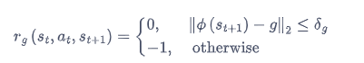
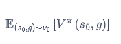

1、简介  
PPO、SAC等经典的深度强化学习算法，大部分算法都能在各自的任务中取得比较好的效果，但是它们都局限在单个任务上，换句话说，对于训练完的算法，在使用时它们只能完成一个特定
的任务。如果面对较为复杂的复合任务，之前的强化学习算法往往不容易训练出有效的策略。目标导向的强化学习(goal-oriented reinforcement learning,GoRL)，以及该类别下的一种经典算法
HER。GoRL学习一个策略使其在不同的目标条件下奏效，以此来解决较为复杂的决策任务。

2、问题定义  
目标导向的强化学习的实际场景。例如，策略π要操控机械臂抓取桌子上的一个物体。值得注意的是，在每次任务开始，物体的位置可能是不同的，也就是说，智能体需要完成一系列相似并不同的任务。
在使用传统的强化学习算法时，采用单一策略只能抓取同一个位置的物体。对于不同的位置，要训练多个策略。在悬崖漫步的环境中，若目标位置变成右上角，便只能重新训练一个策略。同一个策略无法完成一些列不同的目标.
GoRL的数学形式。有别于一般的强化学习算法中定义的马尔可夫决策过程，在目标导向的强化学习中，使用一个扩充过的元组<S,A,P,rg,G,Φ>来定义MDP，其中，S是状态空间，A是动作空间，P是状态转移函数，
G是目标空间，Φ是一个将状态s从状态空间映射为目标空间内的一个目标g的函数，rg是奖励函数，与目标g有关。目标空间G和目标g。在目标导向的强化学习中，任务是由目标定义的，
并且目标本身是和状态s相关的，可以将一个状态s使用映射函数Φ映射为目标Φ(s)属于G。  
在机械臂抓取物体的任务重：状态s中包含机械臂的力矩、物体的位置等信息。因为任务是抓取物体，所以规定目标g是物体的位置，
此时映射函数Φ相当于一个从状态s中提取物体位置的函数。奖励函数，奖励函数不仅与状态s和动作a相关，在目标导向的强化学习中，还与设定的目标相关，奖励函数的形式
其中，δg是一个比较小的值，表示到达目标附近就不会受到-1的惩罚。在目标导向的强化学习中，由于对于不同的目标，奖励函数是不同的，因此状态价值函数V(s,g)也是基于目标的，动作价值
函数Q(s,a,g)同理。定义v0为环境中初始状态s0与目标g的联合分布，那么GoRL的目标就是优化策略π(a|s, g),使得以下目标函数最大化

3、HER算法
目标导向的学习的奖励往往是非常稀疏的。由于智能体在训练初期难以完成目标而只能得到-1的奖励，从而使整个算法的训练速度较慢。有没有一种方法能有效利用这些“失败”的经验呢？
从这个角度出发，时候经验回放Hindsight Experience Replay HER算法于2017年提出，称为GoRL的一大经典方法。  
假设现在使用策略π在环境中以g为目标进行探索，得到这样一条轨迹：s1，s2，...sT，并且g≠s1，s2，...sT。意味着在这条轨迹上，得到的奖励都是-1，这对训练起到的帮助很小。那么，如果换一个目标g'
来重新审视整条轨迹呢？换句话说，虽然并没有达到目标g，但是策略在探索的过程中，完成了s1，s2,...sT等对应的目标，即完成了Φ(s1)，Φ(s2)...Φ(sT)等目标。如果用这些目标将原先的目标g
替换成新的目标g'，重新计算轨迹中的奖励值，就能使策略从失败的经验中得到对训练有用的信息。这种策略优化算法可以选择任意何时的算法比如DQN、DDPG，伪代码
初始化策略π的参数θ，初始化经验回访池R
For 序列e=0-->E  
&emsp;根据环境给予的目标g和初始状态s0，使用π在环境中采样得到的轨迹{s0,a0,r0...sT,at,rt,sT+1}，将其以(s,a,r,s',g)的形式存入R中  
&emsp;从R中采样N个(s,a,r,s',g)元组
&emsp;对于这些元组，选择一个状态s‘‘,将其映射为新的目标g'=Φ(s'')并计算新的奖励值r'=rg'(s,a,s'),然后用新的数据(s,a,r',s',g')替换原先的元组  
&emsp;使用这些新元组，对策略π进行训练  
end for

对算法中状态s''的选择，HER给出3种不同的方案：（1）【代码使用】Future选择与被改写的元组{s,a,s',g}处于同一个轨迹并在时间上出于s之后的某个状态作为s''(2)episode:
选择与被改写的元组{s,a,s',g}处于同一个轨迹的某个状态作为s''，（3）random:选择经验回放池中的某个状态作为s''.
4、如何实现HER算法  
首先顶一个简单二维平面上的环境。在一个二维网格世界上，每个维度的位置范围是[0,5],在每一个序列的初始，智能体都位于(0,0)的位置，环境将自动从3.5≤x,y≤4.5的矩形区域内生成一个目标。
每个时刻智能体可以选择纵向和横向分别移动[-1,1]作为这一时刻的动作。当智能体距离目标足够近的时候，它将受到0的奖励并结束任务，否则奖励为-1.每条序列的最大长度为50.

5、结论
使用HER算法后，效果有显著提升，HER算法的主要好处是通过重新对历史轨迹设置其目标(shiyongFuture方案)而使得奖励信号更加稠密，进而从原本失败的数据中学习到使新任务成功的经验，提升训练的稳定性和样本效率。