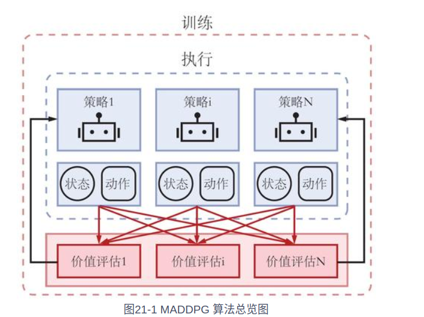
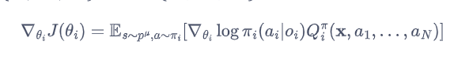
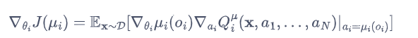
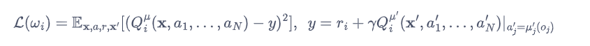
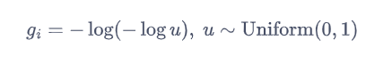
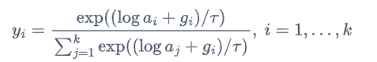

1、简介  
    中心化训练去中心化执行（CTDE，centralized training with decentralized execution），也是一个经典的进阶范式。所谓中心化训练去中心化执行是指在训练的时候采用一些单个智能体看不到全局信息以达到更好的训练效果，而在执行的时候
不使用这些信息，每个智能体完全根据自己的策略直接动作以达到去中心化执行的效果。中心化训练去中心化执行算法能够在训练时有效地利用全局信息以达到更好且稳定的训练效果，同时在进行策略模型推断时可以利用全局信息，使得算法具有一定扩展性。
CTDE可以类比成一个足球队的训练和比赛过程：在训练时，11个球员可以直接获得教练的指导从而完成球队的整体配合，而教练本身掌握着比赛全局信息，教练的指导也是从整只队、整场比赛的角度
进行的；而训练好的11个球员在上场比赛时，则根据场上的实际情况做出决策，不需要教练指导。
    CTDE算法分为两种：一种是基于值函数的方法，如VDN、QMIX等；另一种是基于Actor-Critic的方法，如MADDPG和COMA等，这里介绍MADDPG

2、MADDPG算法
MADDPG多智能体（multi-agent DDPG）从字面意思看就是每个智能体实现一个DDPG算法。所有智能体共享一个中心化的Critic网络，该Critic网络再训练的过程中同时
对每个智能体的Actor网络给出指导，而执行时每个智能体的Actor网络则完全独立做出动作，即去中心化地执行。
CTDE算法的应用场景通常可以被建模为一个部分可观测马尔可夫博弈：用S代表N个智能体所有可能的状态空间，这是全局的信息。对于每个智能体i，其动作空间为Ai，观测空间为Oi，每个智能体的策略
为πθi:Oi * Ai-->[0,1]是一个概率分布， 用来表示智能体在每个观测下采取各个动作的概率。环境的状态转移函数为T:S * A1 * ....AN-->Ω(S).每个智能体的奖励函数为
ri:S * A --> R,每个智能体从全局状态得到的部分观测信息为oi:S ->Oi,初始状态分布为ρ:S-->[0,1]。每个智能体的目标是最大化其期望累积奖励E[Σγ^tri^t]。

每个智能体用Actor-Critic的方法训练，但不同于传统单智能体的抢矿，在MADDPG中每个智能体的Crititc部分都能够获得其他智能体的策略信息。具体来说，考虑一个又N
个只能体的博弈，每个智能体额策略参数为θ={θ1，....θn}，记π={π1...πN}为所有智能体的策略集合，那么我们可以得到在随机性策略情况下每个智能体的期望收益的策略梯度：
,其中Qi^π(x,a1,...aN)就是一个中心化的动作价值函数。一般来说x=（o1,...oN）包含了所有智能体的观测，另外Qi也需要输入所有智能体在此刻的动作，因此Qi
工作的前提就是所有智能体要同时给出自己的观测和相应的动作。
对于确定性策略来说，考虑现在有N个连续的策略μθ,可以得到DDPG的梯度公式：
其中，D是我们用来存储数据的经验回放池，它存储的每一个数据为(x, x', a1,...aN,t1,...tn).而在MADDPG中，中心化动作价值函数可以按照下面的损失函数来更新：
其中，μ'=(μθ1',...,μθN‘)是更新价值函数中使用的目标策略的集合，它们有着延迟更新的参数。
伪代码：  
随机初始化每个智能体的Actor网络和Critic网络  
for 序列 e = 1-->E do  
&emsp; 初始化一个随机过程N，用于动作探索；  
&emsp; 获取所有智能体的初始观测x;  
&emsp;for t = 1-->T do:  
&emsp;&emsp;对于么个智能体i，用当前的策略选择一个动作ai=μθi(oi)+Nt  
&emsp;&emsp;执行动作a=(a1,..,aN)并且获得奖励r和新的观测x'
&emsp;&emsp;把（x,a,r,x'）存储到经验回放池D中  
&emsp;&emsp;从D中随机采样一些数据  
&emsp;&emsp;对于每个智能体i,中心化训练Critic网络   
&emsp;&emsp;对于每个智能体i，训练自身的Actor网络  
&emsp;&emsp;对每个智能体i，更新目标Actor网络和目标Critic网络  
&emsp;end for  
end for  
3、使用Gumbel-softmax完成离散动作数据的近似采样得到连续空间的动作  
假设有一个随机变量Z服从某个离散分布 K=(a1,...ak).其中ai∈[0,1]表示P(Z=ib)并且满足Σi=1到kai=1。我们希望按照这个分布即z~K进行采样时，可以返现这种离散分布的采样时不可导的。
如何让离散分布的采样可导呢？就是重参数化方法，chpt14的SAC算法中提到过，这里使用Gumbel-softmax技巧。具体来说，我们引入一个重参数因子gi,它是一个采样子Gumbel（0，1）的噪声：
.Gumbel-Softmax采样可以写成：,此时，如果通过z=argmaxiyi计算离散值，该离散值就近似等于离散采样z~K
的值。更进一步，采样的结果y中自然地引入了对于a的梯度。τ>0倍称作分布温度参数，通过调整它可以控制生成Gumbel-softmax分布与离散分布的近似程度；τ越小，生成的分布越趋向于onehot(argmaxi(logai+gi))的结果；
τ越大，生成的分布越趋向于均匀分布。
4、总结  
正常智能体agent_0和agent_1的回报结果完全一致，因为他们的奖励函数完全一样，正常智能体最终保持了正向的回报，说明，
他们通过合作成功地占领了两个不同的地点，进而让对抗智能体无法知道哪个地点是目标地点。另外，MADDPG的收敛速度和稳定性都是不错的

