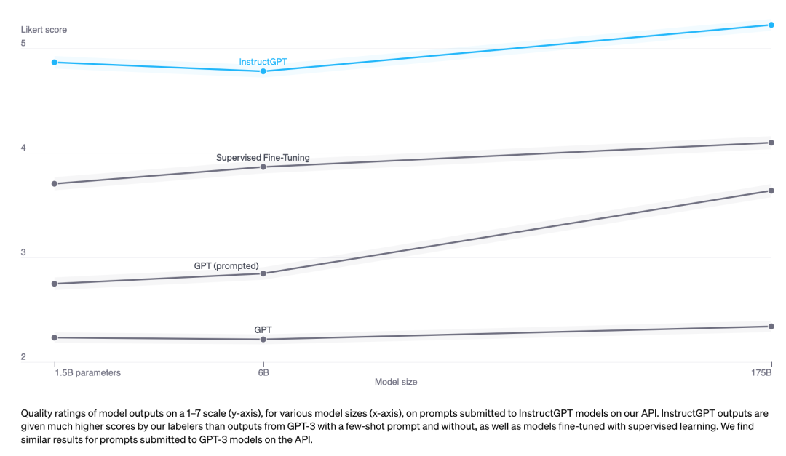
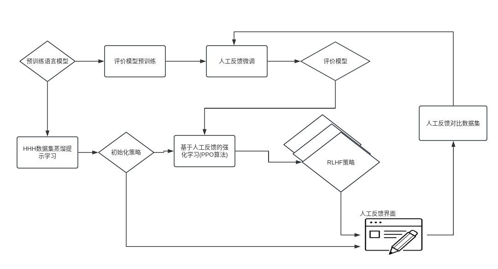

《ChatGPT原理与实战》--RLHF框架简介  
1、RLHF简介  
基于人工反馈的强化学习的第一篇论文是OpenAI公司前成员在入职Anthropic公司后于2022年4月提出的，此时PPO算法已经诞生4年多。从时间上可以看出，
并非先有RLHF框架后有实战算法，而是先有算法后有训练框架。原因是基于人工反馈的强化学习时强化学习的一个分支，而PPO算法的使用场景更广泛。在RLHF
的场景下，我们仍然可以使用大部分强化学习算法，例如在DeepMind团队开发Sparrow时使用的A2C算法，OpenAI团队开发InstructGPT使用的PPO算法。  
由此可见，RLHF框架并不等同于PPO算法，只不过因为ChatGPT的成功，许多人将二者联系起来。    
2、RLHF内部剖析  
。横坐标表示模型参数规模，主要关注13亿参数、60亿参数
以及1750亿参数这3个规模下模型精度效果对比。纵坐标表示当前模型效果与1750亿参数全量监督学习参数微调对比得分，值越大说明效果越好，越接近全量SFT效果。  
既然全量SFT效果最优，为什么还要测试这么多种方法？直接基于任务SFT不就可以了么？需要说明的是，全量SFT对标注数据、训练时间、场景建模、训练资源方面都有极为苛刻的要求，因此，论文作者
希望避免全量SFT，通过实验验证并结合不同的优化技巧，发现在仅使用少量资源的情况下达到全量SFT相似的效果。  
InstructGPT提出的优化策略包括基于指示学习的GPT、针对部分任务的SFT、PPO强化学习及混合语言模型预训练与PPO的综合策略。最基础的GPT模型效果表现最差，
上述优化策略都从不同程度上提高了原本GPT模型的效果。这也正是GPT3.5+与原先GPT-3模型的差异。其中，PPO与PPO+预训练的整体效果最为亮眼。在PPO的训练下，1.3B模型额表现好
于175B微调模型。由此可见，PPO策略具有巨大优势。  
    RLHF通过预训练语言模型来开展行为模型与评价模型的建模。在行为模型的建模过程中，利用人工指导的满足3H要求的数据来进行指导学习。在评价模型中，
利用人工反馈进行模型微调。最后，在迭代环节采用PPO强化学习算法，对上述两个模型进行参数更新，更新方式是利用人工反馈的交互界面。人工在界面中评价模型不同维度
的内容，包括模型生成质量、内容相关度、多条声场结果的排序值、模型生成结果是否有害等。RLHF通过相关板块的联动，并利用人工反馈的方式弥补了生成模型缺乏环境反馈的问题。  
3、RLHF解决了什么问题  
强化学习在实际表现中非常出色，但是在已有监督学习建模训练的场景下，强化学习发挥了什么作用，需要我们引起高度重视。本质上，强化学习的过程也是一种学习，
不同于监督学习的亲手指导，强化学习更多地要求模型在环境中感知，从反馈中学习。因此，RLHF的本质上想要解决并非精准问题，而是对齐问题。即模型可以通过
监督学习实现精度的提高，而通过强化学习实现生成对齐。其中对齐的对象便是人类。  
我们在使用ChatGPT时会发现，当它遇到不会回答的问题时，总会一本正经地胡说八道，这种求生欲极高的回答好像就是求职者在被问到面试时不会回答的问题，仍然会
编造一个答案。强化学习的加入让模型生成的记过更像人的回答，而并不是关注答案本身。这也提醒我们，或许ChatGPT回答的并不准确，而是我们期待它回答的内容。  
4、RLHF价值分析  
（1）弱化人类的干预  
OpenAI在其官方报告中表明，当前GPT-4的训练已经完全弱化了对第一阶段（即人工标注提示样本）的依赖，仅依靠第二阶段（即人工标注模型生成的多样本的优势）
和第三阶段即PPO强化学习就可以实现模型的稳步优化。这极大地降低了人类为模型标注数据的成本。  
回顾自然语言处理的发展历程，从Bert模型在同等样本情况下精度全面领先传统机器学习模型，再到小样本、元学习对样本的大幅下降，进而到当今预训练大型语言模型
出现的零样本、ICL情况下的智能涌现，最终到GPT-4对于SFT本身的弱依赖及其同PPO的全面拥抱，我们惊喜地发现人工干预逐步减少，模型对人类的依赖同时
也逐步降低。  
（2）实现强化学习同大型语言模型的价值联动  
很长一段时间内， 自然语言处理方向的从业者并不看好强化学习在自身领域的应用，因为它缺乏客观稳定的评价函数。RLHF框架的出现及时地创新地利用人工弥补了这个
缝隙，使得强化学习得以应用在大型语言模型的研制过程中。  
    从结果来看，加入强化学习后大型语言模型的整体效果带来了惊喜。ChatGPT以及GPT-4的成功将极大鼓舞相关从业者，基于前车之鉴，敢于在自身任务重加入人工
反馈机制，运用强化学习机制实现模型的自我优化。这也将使得更多人投身于强化学习的研究中，相信会产生更多更加适应现实场景变化的全新模型与算法框架。  
（3）机器同人类的认知对齐  
RLHF的本质时希望实现机器生成结果与人类本身认知的对齐。经过最近几个月针对ChatGPT与GPT-4的体验，越来越多人发现，虽然大语言模型仍然无法保证答案的
事实准确性，但其思考问题的方式、回答问题的表达方式与人类极其相似。我们可以将ChatGPT看做一个智者，它比我们绝大多数人储备的知识更加全面，逻辑更加
清晰，表达更加合理，但是人无完人，智者也会犯常识性错误，更何况它作为刚诞生不久的智能体。  
    机器生成结果与人类预期的一致性将让更多人接受、拥抱AIGC模型，同时思考未来如何与其共存，并利用它实现自身效率的全方位提升。就像我们已经无法想象
没有搜索引擎的互联网时代，也许在不远的未来，我们也无法想象没有AIGC的互联网时代。  
5、RLHF问题分析  
(1)优化效果影响不显著问题  
OpenAI在其关于GPT-4的分析报告中指出，通过预训练语言模型的学习，GPT-4模型可以达到评价任务73.7%的评价指标，而RLHF阶段仅将结果提升了74%。
初看这个结果我们可能非常失望，因为其模型的主要贡献来源于预训练语言模型的学习与提示指令学习，强化学习效果首先甚微。但是我们需要关注的是，
强化学习的目标并不是提高模型精度，而是让模型效果与人类表述实现对齐。因此，再生成更加拟人化的表述同时，还可以实现生成效果的保持甚至提升，本身
已经难能可贵。  
（2）人工反馈标注成本过高问题  
OpenAI花费最大的精力并不是在算力资源或者算法架构上，而是投入大量人力进行标注，在绝大公司还在苦恼监督学习标注样本过少的问题时，OpenAI已经展开对
模型生成答案的评价反馈，并且基于此反馈开展强化学习建模。这里人工反馈标注成本极高，虽然我们从直观上看，人工反馈生成效果的好坏较为容易，
但在标注过程中，如何统一标准，如何确保标注人员对问题答案的理解足够专业，如何确保标注人员的个人偏好和倾向与大众保持一致等问题都需要解决。
值得庆幸的是，OpenAI作为优秀的榜样，已经雁阵了技术路线的整体可行性，成本过高的问题可以参考斯坦福桥的Alpaca羊驼等一系列新模型的建模思路。
（3）最佳实践的效果难以复现问题  
伴随着GPT-4的全面闭源，我们难以得知其模型的参数规模、训练细节、网络结构等一系列内容，这给我们开展大语言模型训练带来了进一步挑战。如果方向选错，可能
面临着数月的成果付诸东流。在模型训练的过程中，不了解方向更容易导致研发人员怀疑自己的选择，难以判断是模型优化问题还是数据治理问题。但是，OpenAI的团队
之前也面临这些挫折，而他们原来走的路更加充满未知，因此不能因难以复现而放弃研究，反而，我们要在不断的研究中，分析加入人工反馈强化学习的模型究竟带来了什么改变。
 

补充：InstructGPT三大步：
SFT：生成模型GPT的有监督精调 (supervised fine-tuning)
RM：奖励模型的训练(reward model training)
PPO：近端策略优化模型( reinforcement learning via proximal policy optimization)