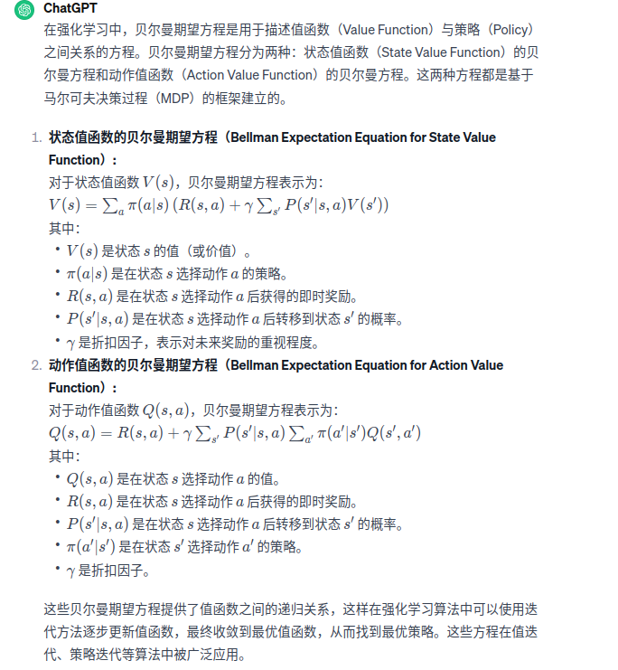
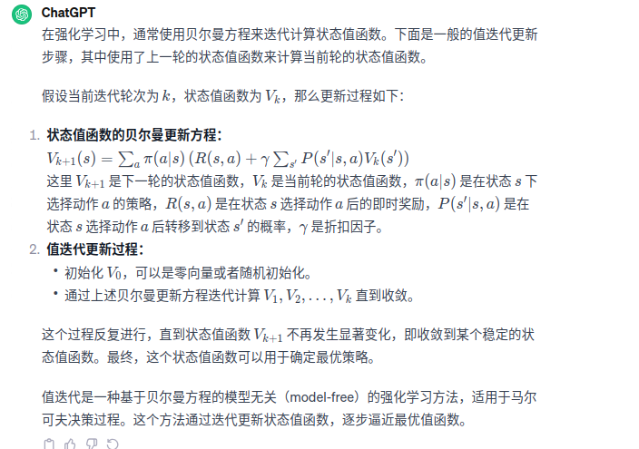

前提公式是：最优状态价值函数和最优动作价值函数之间的关系Q*(s,a) = r(s,a) + γ∑P(s'|s,a)V*(s')  
1、基于动态规划的强化学习的思路
    基于动态规划的强化学习算法优两种：一种是策略迭代policy iteration、另一个是价值迭代value iteration。其中策略迭代由两部分组成：策略评估policy evaluation和策略提升policy improvement
具体来说，策略迭代中的策略评估使用贝尔曼期望方程来得到一个策略的状态价值函数，这是一个动态规划过程；而价值迭代直接使用贝尔曼最优方程来进行动态规划，得到最终的最优状态价值函数。
    基于动态规划的强化学习的要求：（1）事先知道环境的状态转移函数和奖励函数，也就是需要知道整个马尔可夫决策过程！！！（2）所以说，这是一个白盒的环境，在这个环境中不需要智能体和环境的大量交互学习，
可以直接用动态规划来求解状态价值函数。但是，现实中的白盒环境很少，所以这是动态规划算法求解强化学习的局限之处。（3）另外，策略迭代和价值迭代通常只适用于有限马尔可夫决策过程，即状态状态空间和动作空间
是离散且有限的。

2、策略迭代算法
    策略迭代是策略评估和策略提升不断循环交替，直到最后得到最优策略的过程。  
  
    其中π(a|s)是在状态s下采取动作a的概率。当知道奖励函数和状态转移函数是，我们可以根据下一个状态的价值来计算当前的价值。因此，根据动态规划的思想可以把计算下一个可能得状态的价值当成一个子问题，把计算当前状态的价值看做当前问题。也就是动态规划中，得到子问题的解来求当前问题。
  
    我们可以选定任意初始值V0，根据贝尔马期望方程，可以得知Vk=Vπ是以上更新更是的一个不动点。当k接近无穷大的时候{Vk}会收敛到Vπ，所以据此来计算一个策略的额状态价值函数。
在实际过程中，如果某一轮的max|Vk+1(s) - Vk(s)|的值非常小，就可以提前结束策略评估，得到的价值非常接近真实价值。
3、策略提升
    使用策略评估计算得到当前策略的状态价值函数后，就可以改进策略。假设此时对于策略π，我们已经知道其价值Vπ，也就是知道了在策略π下每一个状态s出发最终得到的期望回报。
。我们要如何改变策略来获得在状态s下更高的期望回报呢？假设智能体在状态s下采取动作a之后的动作依旧遵循策略π，此时得到的期望回报其实就是动作价值Qπ(s,a)。如果Qπ(s,a)大于Vπ(s),
则说明在状态s下采取动作a会比原来的策略π(a|s)得到更高的期望回报。现在假设存在一个确定性策略π'，在任意一个状态s下，都满足：Qπ(s,π'(s)) ≥Vπ（s）。
于是在任意状态下有Vπ'(s)≥Vπ(s)，这就是梯度提升定理。我们可以贪心地在每一个状态选择动作价值最大的动作。  
4、策略迭代
    策略迭代的目标函数，得到最优策略π
    π'(s)=arg maxQπ(s,a) = argmax{r(s, a) + γ∑P(s'|s,a)Vπ(s')}  
5、价值迭代算法【从策略迭代算法更新为价值迭代算法--后续就是以这个为目标】
    思路更新：只在策略评估中进行一轮价值更新，然后直接根据更新后的价值进行策略提升。价值迭代算法可以被认为是一种策略评估只进行了一轮更新的策略迭代算法。
价值迭代中不存在显式的策略，我们只维护一个状态价值函数！
    就是把开头最前面最优状态价值函数和最有动作价值函数之间的关系变成：
    V*(s,a) = max{r(s,a) + γ∑P(s'|s,a)V*(s')}，当V*【k+1】= V*【k】的实收迭代停止  
结论：价值迭代算法比策略迭代价值算法迭代次数少很多

6、冰湖环境问题Frozen Lake  
&nbsp;&nbsp;在OpenAi的GYM库中,有很多有名的环境，例如Atari和MuJoco。其中，冰湖环境和悬崖列斯，也是网格世界4*4,智能体的S在左上角，
目标状态G在右下角