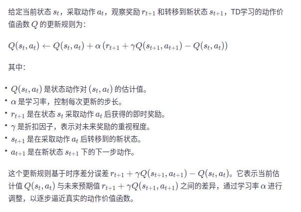
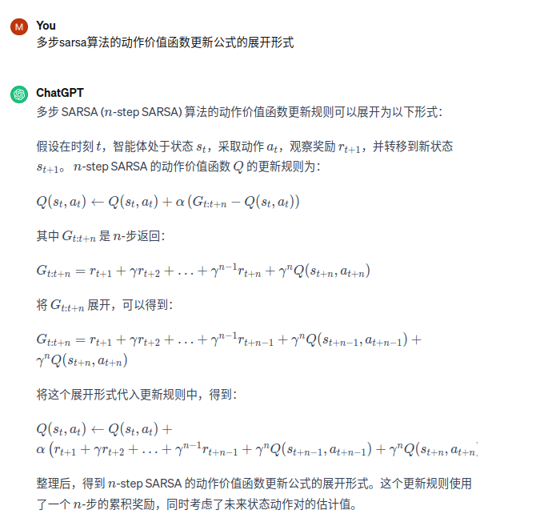
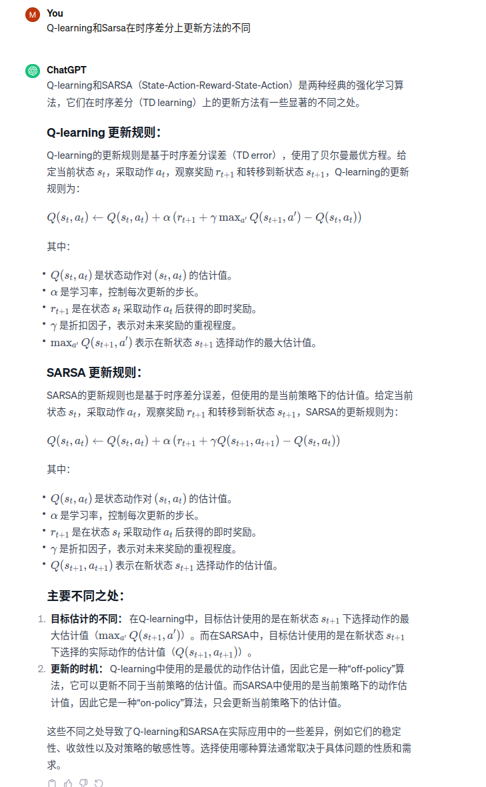

前提公式是：最优状态价值函数和最优动作价值函数之间的关系Q*(s,a) = r(s,a) + γ∑P(s'|s,a)V*(s') 
1、时序差分算法和动态规划算法的区别：  
直接动态规划算法类似于有监督的学习任务，对各个状态价值都是已知的，直接显式给出了数据的分布公式，可以通过期望直接最小化模型的泛化误差来更新模型参数，不需要任何采集数据点。
但是在大部分场景下，都是在数据分布位置的情况下针对具体的数据点来对模型做出更新。对于大部分强化学习场景，其马尔可夫决策过程的状态转移概率是无法给出的，也就无法直接使用动态规划，这种情况下，智能体智能和环境交互，
通过采样到的数据来学习，这类学习方法统称为无模型的强化学习（model-free reinforment learning）。
2、时序差分算法两种经典模型：  
不同于动态规划算法，无模型的强化学习算法不需要事先知道环境的奖励函数和状态转移函数，而是直接使用和环境交互的过程中采样到的数据来学习。  
Sarsa和Q-learning都是基于时序差分Temporal difference，TD的强化学习算法。  
3、在线策略学习和离线策略学习
通常来说，在线策略学习要求使用在当前策略下采样得到的样本进行学习，一旦策略被更新，当前的样本就被放弃了。而离线策略学习使用经验回放池将之前采样得到的样本收集起来再次利用。因此，离线策略学习往往能够
更好地利用历史数据，并具有更小的样本复杂度（算法达到收敛结果需要在环境中采样的样本数量），这使其被更广泛地应用。  
4、时序差分  
时序差分是一种用来估计一个策略的价值函数的方法，它结合了蒙特卡洛和动态规划的算法思想。时序差分方法和蒙特卡洛算法的相似之处在于可以从样本数据中学习，不需要事先知道环境；和动态规划思想的相似之处在于可以更具贝尔曼方程的思想，
利用后续状态的价值估计来更新当前状态的价值估计。  
蒙特卡洛方法对价值函数增量更新方式:V(st) <---V(st)+a[Gt-V(st)]。蒙特卡洛方法必须要等整个序列采样结束之后才能计算得到这一次的回报Gt，而时序差分算法只需要当前步结束即可进行计算。具体来说，时序差分算法
用当前获得的奖励加上下一个状态的价值估计来作为当前状态会获得的回报，即V(st) <---V(st)+a[rt+γV(st+1)-V(st)],rt+γV(st+1)-V(st)这部分称为时序差分TD，书中给出了用rt+γV(st+1) 来替代 Gt的公式
Vπ(s) = Eπ[Gt|St=s] = Eπ[Rt+γVπ(St+1)|St=s],蒙特卡洛算法使用公式中间部分作为更新目标，时序差分用公式最后部分作为更新目标。在用策略和环境交互时，每采样一步，就可以用时序差分算法来更新状态价值估计。时序差分算法用到了
V(St+1)的估计值，可以证明它最终收敛到策略π的价值函数。  
5、Sarsa算法
我们在不知道奖励函数和状态转移函数的情况下该怎么进行策略提升？答案是可以直接使用时序差分算法来估计动作价值函数Q：
    
 然后我们利用贪婪算法来选取在某个状态下动作价值最大的那个动作，即argmax[a]Q(s,a)。这样就是一个完整的强化学习算法：用贪婪算法根据动作价值选择动作来和环境交互，再根据得到的数据用时序差分算法更新动作价值估计。
 6、Sarsa算法的迭代策略  
 采用一个ε-贪婪策略，有1-ε的概率采用动作价值最大的那个动作，另外有ε的概率从动作空间随机采取一个动作。
 7、Sarsa算法整体流程  
初始化Q(s,a)  
for 序列 e=1->E do:  
&emsp; 得到初始状态  
&emsp; 用ε-贪婪策略根据Q选择当前状态下s的动作a  
&emsp; for 时间步t=1->T do:  
&emsp; &emsp; 得到环境反馈的r,s'  
&emsp; &emsp; 用ε-贪婪策略根据Q选择当前状态s‘下的动作a'  
&emsp; &emsp; Q(s,a) <--- Q(s,a) + α[r+γQ(s', a')-Q(s,a)]  
&emsp; &emsp; s<--s', a<---a'  
&emsp; end for  
end for   
8、Sarsa算法主要维护一个Q_table()表格，用来存储当前策略下所有状态动作对的价值，在用Sarsa算法和环境交互时候，用ε贪婪策略进行采样，在更新Sarsa
算法时候，使用时序差分算法的公式。我们默认终止状态时所有动作的价值都是0， 这些价值在初始化为0后就不会进行更新。

9、为什么会有多步时序差分【蒙特卡洛的大方差和时序差分的有偏的问题】
蒙特卡洛方法利用当前状态之后每一步的奖励而不使用任何价值估计，时序差分算法值利用一步奖励和下一个状态的价值估计。那么它们之间的区别是什么呢？
总的来说，蒙特卡洛方法是无偏的，但是具有比较大的方差，因为每一步的状态转移都有不确定性，而每一步状态采取的动作所得到的不一样的奖励最终都会加起来，
这会极大影响最终的价值估计；时序差分算法具有非常小的方差，因为只关注了一步状态转移，用到了一步的奖励，但是它是有偏差的，因为用到了下一个状态的价值估计而不是真实的价值。  
所以要使用多步时序差分来弥补两者一个是有偏差，一个是大方差的问题。多步时序差分的意思就是使用n步的奖励，然后使用之后状态的价值估计：
将 Gt = rt+γQ(st+1,at+1) 替换成 Gt = rt+γrt+1+...γ^nQ(St+n, at+n).对应的Sarsa动作价值函数的更新公式也要改变：
  

10、Q-learning算法
Q-learning和Sarsa算法区别在于时序差分的更新方法,在当前Q上多了一个max取值。

根据最优价值公式，Q-learning的贝尔曼方程可改写为Q*(s,a) = r(s,a) + γ∑P(s'|s,a)maxQ*(s',a') 
Sarsa是估计当前ε贪婪策略的动作价值函数【就是这个Q(s,a) <--- Q(s,a) + α[r+γQ(s', a')-Q(s,a)] 】。需要强调的是Q-learning的更新并非必须使用当前贪婪策略
argmaxQ(s,a)采样得到的数据，因为给定任意（s, a, r,s'）都可以直接根据更新公式来更新Q，为了探索，我们通常需要使用一个ε-贪婪策略来与环境交互。Sarsa必须使用当前ε贪婪策略采样得到的数据，
因为它的更新中用到的Q(s',a')中的a‘是当前策略在s'下的动作。我们称Sarsa是在线策略算法，Q-learning是离线策略算法。  

11、在线策略算法与离线策略算法
我们称采样数据的策略为行为策略，称用这些数据来更新的策略为目标策略。在线策略算法表示行为策略和目标策略是同一个策略；而离线策略算法表示行为策略和目标策略不是同一个策略。
Sarsa是典型的在线策略算法，而Q-learning是典型的离线策略算法。判断二者类别的一个重要手段就是看计算时序差分的价值目标的数据是否来自当前的策略，具体：
（1）对于Sarsa，他的更新公式必须使用当前策略采样得到的五元组(s,a,r,s',a')，它是在线策略算法。
（2）对于Q-learning，他的更新公式使用四元组（s,a,r,s'）来更新当前动作对的动作价值Q（s，a），数据中的s和a是给定的条件，r和s'是从环境采样得到，该四元组并不需要
一定是当前策略采样得到的数据，也可以来自自行为策略，因此是离线策略算法。
（3）离线算法能够重复使用过往训练样本，具有更小的样本复杂度，深受欢迎。  

12、结论
Q-learning更偏向于走在悬崖的边上（所以回报曲线抖动非常严重），这与Sarsa算法得到的比较保守的策略相比是更优的。
但是在训练过程中，从回报曲线上看，在一个序列中sarsa获得的的期望回报高于Qlearning。因为在训练过程中，智能体采取基于当前Q(s,a)函数的ε贪婪策略来平衡探索与利用，
Q-learning算法沿着悬崖边缘走，会有一定概率探索掉入悬崖这个动作，而Sarsa相对保守的路线使得智能体记录不可能掉入悬崖。

13、用处
当环境是有限状态集合和有限动作集合时候，这两个算法非常有用，sarsa比较保守，Qlearning会探索“掉下去的可能”。尽管离线策略学习可以让智能体基于经验回放池中的样本来学习，
但是需要保证智能体在学习的过程中不断和环境进行交互，将样本得到的最新的经验样本加入经验回放池中，从而使经验回放池中有一定数量的样本和当前智能体策略对应的数据分布保持很近的距离。
如果不允许智能体在学习过程中和环境进行持续狡猾，而是完全基于一个给定的样本集来直接训练一个策略，这样的学习范式称为离线强化学习