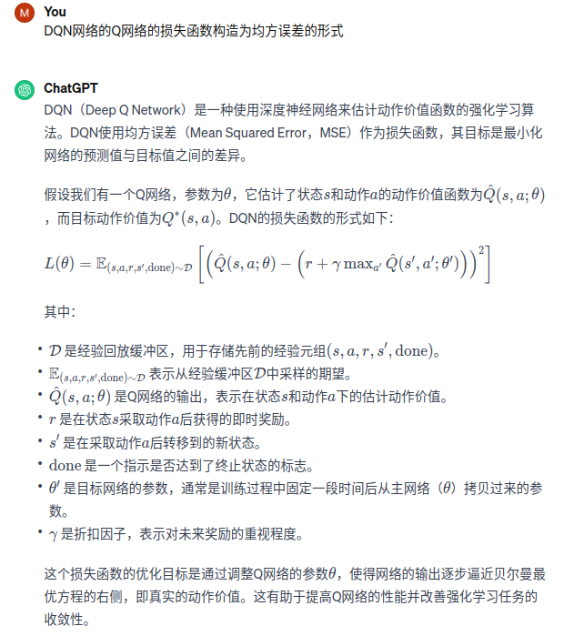

时序差分的更新公式Q(s,a) <--- Q(s,a) + α[r+γQ(s', a')-Q(s,a)]   
**本章目标：让Qw(s,a)逼近r+γQ(s', a')**  
1、离散空间强化学习的局限性  
我们在时序差分算法中建立了一张存储每个状态下所有动作的Q值的表格。表格中的么个动作价值Q(s,a)表示在状态s下选择动作a然后继续遵循某一策略预期得到的期望回报。
然而，这种用表格存储动作价值的做法只在环境的状态和动作都是离散的，并且空间都比较小的情况下适用。当状态和动作数量非常大时候就不适用了。比如图像大小是210*160*3，再用256^(210*160*3)存放
就不行了。在动作对复杂的时候，我们需要使用拟合函数方法来估计Q值，将这个Q值表格视为数据，使用一个参数化的函数Qθ来拟合这些数据。
2、环境：车杆环境
状态值是连续的，动作是离散的，智能体的状态是一个维数为4的向量，每一维都是连续的，动作是离散的，动作空间大小为2  
3、DQN（处理离散动作）   
我们想在类似车杆的环境中得到动作价值函数Q(s,a)，由于状态每一维度的值都是连续的，无法用表格记录，因此一个最常见的方法就是使用函数拟合的思想。由于神经网络具有强大的表达能力，因此我们使用一个
神经网络Q来表示函数Q。若动作是连续（无限）de ,神经网络的输入是状态s和动作a，然后输出一个标量，表示在状态s下采取动作a能获得的价值。若动作是离散（有限）的，除了可以采取动作连续情况下的做法，我们还可以只将状态s输入到神经网络
中，使其同时输出每一个动作的Q值。通常DQN只能处理动作离散的情况，因为在函数Q的更新过程中有max的操作。假设神经网络用来拟合函数Q的参数是w，即每一个状态s下所有可能动作a的Q值都能表示为Qw(s,a).我们将
用于拟合函数Q的神经网络称为Q网络
4、DQN网络的更新规则
Q-learning的更新规则Q(s,a) <--- Q(s,a) + α[r+γmaxQ(s', a')-Q(s,a)] ,目标就是让Q(s,a)向TD误差目标r+γmaxQ(s', a')靠近。
对于一组数据{(si,ai,ri,si')}我们可以将Q网络的损失函数构造为均方误差的形式  

5、经验回放  
在一般的有监督学习中，假设训练数据是独立同分布的，我们每次训练神经网络的时候从训练数据中随机采样一个或者若干个数据来进行梯度下降，随着学习的不断进行，每一个训练数据
会被利用多次。在原来的Q-learning算法中，每一个数据只会用来更新一次Q值。为了更好地将Q-learning和深度神经网络结合，DQN采用了经验回放experience replay方法，具体做法为维护一个
回放缓冲区，将每次从环境中采样得到的四元组数据（状态、动作、奖励、下一状态）存储到回放缓冲区中，训练Q网络的时候在从回放缓冲区中随机采样若干数据来进行训练，这么做有两个作用：
（1）使样本满足独立假设。在MDP中交互采样得到的样本本身不满足独立鸡舍，因为这一时刻的状态和上一个时刻状态有关。非独立同分布的数据对训练神经网络有很大影响，会使得神经网络拟合到最近训练的数据上。
采用经验回放可以打破样本之间的相关性，让其满足独立假设。
（2）提高样本效率。每一个样本可以被使用多次，十分适合深度神经网络的梯度学习。  
6、目标网络和训练网络的更新步骤
本章目标：让Qw(s,a)逼近r+γQ(s', a'),由于TD误差目标本身就包含神经网络的输出，因此在更新网路哦参数的同时目标也在不断地改变，这非常容易造成神经网络训练的不稳定。
为了解决这一问题，DQN使用了目标网络target network的思想：既然在训练过程中Q网络的不断更新会导致目标不断发生改变，不如暂时先将TD误差目标中的Q网络固定住。为了这一思想，我们需要利用两套Q网络
（1）【训练网络】原来的训练网络Qw(s,a)，用于计算原来的损失函数Qw(s,a)-[r+γQ(s', a')]²中的Qw(s,a)项，并且使用正常梯度下降的方法来更新。
（2）【目标网络】目标网络Qw-(s,a)【注意这个网络和上一个网络的区别】，用于计算原来的损失函数中r+γQ(s', a')这部分，其中w-表示目标网格中的参数。如果两套网络的参数随时保持一致，则仍未原来不够稳定的算法。
为了让更新目标更稳定，目标网络并不会每一步都更新。具体而言，目标网络使用训练网络的的一套比较旧的参数，训练网络Qw(s,a)在训练中的每一步都会更新，
而目标网络的参数每隔C步才会与训练网络同步一次，即w-<---w。这样做使得目标网络相对训练网络更加稳定。  
伪代码:  
用随机的网络参数w初始化网络Qw(s,a)  
复制相同的参数w-<--w来初始化目标网络Qw'  
初始化经验回放池R  
for 序列 e = 1 --> E do  
&emsp; 获取环境初始状态s1  
&emsp; for 时间步t = 1 --> T do  
&emsp;&emsp; 根据当前网络Qw(s,a),以ε贪婪策略选择动作at  
&emsp;&emsp; 执行动作at，获得回报rt，环境状态变为st+1  
&emsp;&emsp; 将(st,at,rt,st+1)存储在回访池R中  
&emsp;&emsp; 若R中数据足够，从R中采样N个数据{(si,ai,ri, si+1)}i=1,,,N  
&emsp;&emsp; 对每个数据，用目标网络计算yi=ri+γmaxQw-(si+1, a)  
&emsp;&emsp; 最小化目标损失L=1/N∑(yi-Qw(si,ai))²，以此更新当前网络Qw  
&emsp;&emsp; 更新目标网络  
&emsp; end for  
end for
