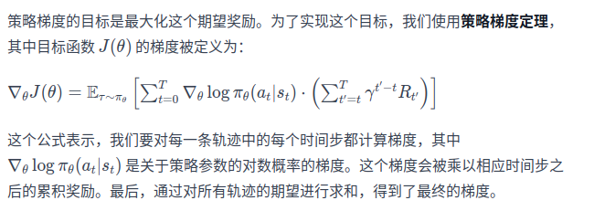

1、基于策略梯度算法  
DQN、QLearning都是基于价值的算法，其中Qlearning处理有限状态，DQN可以用来解决连续状态的问题。在强化学习中，除了基于值函数的方法，还有一种非常经典的方法，就是基于策略policy-based
的方法。对比两者，基于值函数的方法主要是学习值函数，然后根据值函数到处一个策略，学习过程并不存在一个显式的策略；而基于策略的方法则是直接显式地学习一个目标策略。
策略梯度是基于策略的方法的基础。
2、策略梯度  
基于策略的方法受限需要将策略参数化。假设目标策略πθ 是一个随机性策略，并且处处可谓，其中θ 是对应的参数。我们可以用一个线性模型或者神经网络模型来为这样一个策略函数
建模，输入某个状态，然后输出一个动作的概率分布。我们的目标是寻找一个最优策略并最大化这个策略在环境中的期望回报。我们将策略学习的目标定义为J(θ)=Eso[Vπ（s0）]
,其中，s0表示初始状态。现在有了目标函数，我们将目标函数对策略θ 求导，得到导数后，就可以用梯度上升方法来最大化这个目标函数，从而得到最优策略。
    J(0)公式的对应梯度公式：
这个梯度可以用来更新策略，因为式子中期望E的下标是πθ，所以策略梯度算法是在线策略on-policy算法，即必须使用当前策略πθ采样得到的数据来计算梯度。只管理解策略梯度这个公式，
可以发现在每一个状态下，梯度的修改是让策略更多地采样到带来较高Q值的动作，更少采样到带来较低Q值的动作。
3、如何对Qπθ（s,a）进行估计--蒙特卡洛方法--REINFORCE算法实现
蒙特卡洛方法对一个有限步数的环境来说，REINFORCE算法中的策略梯度为
，T是和环境交互的最大步数。
4、算法伪代码流程  
初始化策略参数θ  
for 序列 e = 1 --> E do:  
&emsp;用当前策略πθ采样轨迹{s1,a1,r1,s2,a2,r2,....sT,aT,rT}  
&emsp; 计算当前轨迹每个时刻t往后的回报∑γrt'，记为ψt
&emsp; 对θ进行更新，θ = θ + a∑ψ∇θlogπθ(at|st)  
end for  

5、结论
    随着收集到的轨迹越来越多，REINFORCE算法有效地学习到了最优策略，不过，相比于之前的DQN算法，REINFORCE算法使用了更多地序列，这是因为
REINFORCE算法是一个在线策略算法，之前收集到的轨迹数据不会再次被利用。此外，REINFORCE算法的性能也有一定程度的波动，主要是因为每条
采样轨迹的回报值波动比较大，这也是REINFORCE算法主要的不足。

    